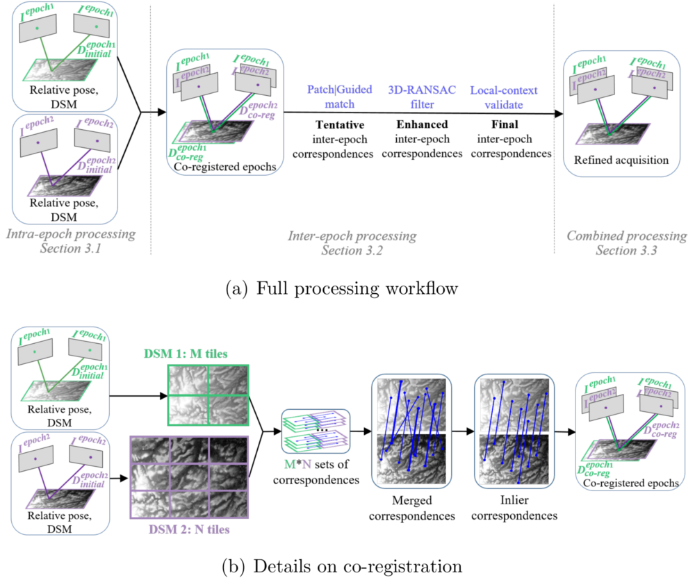

# *Historical pipeline* - tie-points extraction in diachronic images

The algorithm uses a python implementation of the [SuperGlue](https://github.com/magicleap/SuperGluePretrainedNetwork) ([paper](https://arxiv.org/abs/1911.11763)) sparse point detector and matcher (see the license below). For more details please see:
* Zhang, L., Rupnik, E., Pierrot-Deseilligny, M. (2021). Feature matching for multi-epoch historical aerial images. ISPRS Journal of Photogrammetry and Remote Sensing.
* [Tutorial using historical aerial images](https://colab.research.google.com/drive/1poEXIeKbPcJT_2hyQOBhzcj1EEhO8OgD)
* [Tutorial using aerial and satellite images](https://colab.research.google.com/drive/14okQ8bBhEZmy6EGRIQvazTqrN39oc_K5)

<p align="center">
  
</p>

## Set-up 

1. Create virtualenv, clone SuperGluePretrainedNetwork and install depedencies (```PYTHON_PATH``` is the path to ```bin/python```):

    ```bash ./install.sh PYTHON_PATH```

Virtualenv files are stored in python_env/, remove the directory to remove the virtualenv.

The SuperGluePretrainedNetwork is necessary for (1) rough co-registration and (2) precise matching when you set "Feature=SuperGlue". If you fail to install SuperGluePretrainedNetwork, you can still perform precise matching by setting "Feature=SIFT" on the condition that your dataset is roughly co-registered.

## Contents

The pipeline is accessible via 

```mm3d TiePHistoP -help```

## License

This code uses third-party code that is not permitted for commercial use. Please refer to [SuperGlue license](https://github.com/magicleap/SuperGluePretrainedNetwork/blob/master/LICENSE) for more information.
