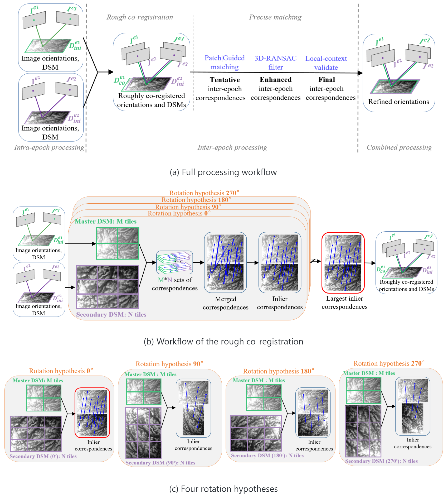

# *Historical pipeline* - tie-points extraction in diachronic images

The algorithm uses a python implementation of the [SuperGlue](https://github.com/magicleap/SuperGluePretrainedNetwork) ([Full paper](https://arxiv.org/abs/1911.11763)) sparse point detector and matcher (see the license below). 

For more details about our algorithm, please see our publication, video, blog and tutorials:
* L. Zhang, E. Rupnik, M. Pierrot-Deseilligny, [Feature matching for multi-epoch historical aerial images](https://www.sciencedirect.com/science/article/pii/S0924271621002707), ISPRS journal of photogrammetry and remote sensing, 182 (2021), pp. 176-189
* [YouTube: Introduction video for "Feature matching for multi-epoch historical aerial images"](https://youtu.be/Pk0Tvpr5UmQ)
* [Blog for "Feature matching for multi-epoch historical aerial images"](https://github.com/LulinZhang/Feature-matching-for-multi-epoch-historical-images)
* [Tutorial using historical aerial images](https://colab.research.google.com/drive/1poEXIeKbPcJT_2hyQOBhzcj1EEhO8OgD)
* [Tutorial using aerial and satellite images](https://colab.research.google.com/drive/14okQ8bBhEZmy6EGRIQvazTqrN39oc_K5)

<p align="center">
  
</p>

## Set-up 

1. Create virtualenv, clone SuperGluePretrainedNetwork and install depedencies (```PYTHON_PATH``` is the path to ```bin/python```):

    ```bash ./install.sh PYTHON_PATH```

Virtualenv files are stored in python_env/. To remove the environement, delete the directory `python_env`.

The SuperGluePretrainedNetwork is necessary for (1) rough co-registration and (2) precise matching using the ```Feature=SuperGlue``` option. If you can't/don't want to install SuperGluePretrainedNetwork, you can still perform precise matching by setting ```Feature=SIFT```. Note that in this case your datasets must be roughly co-registered.

## Contents

The pipeline is accessible via 

```mm3d TiePHistoP -help```

The command ```TiePHistoP``` will launch the whole pipeline by automatically calling several subcommands. You can set "Exe=0" to print all the subcommands instead of executing it.

## License

This code uses third-party code that is not permitted for commercial use. Please refer to [SuperGlue license](https://github.com/magicleap/SuperGluePretrainedNetwork/blob/master/LICENSE) for more information.
