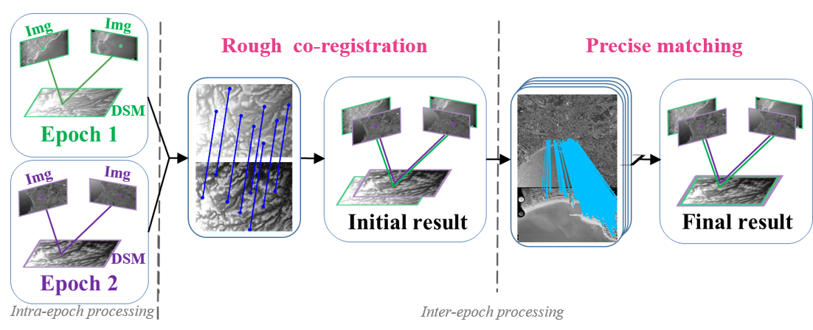
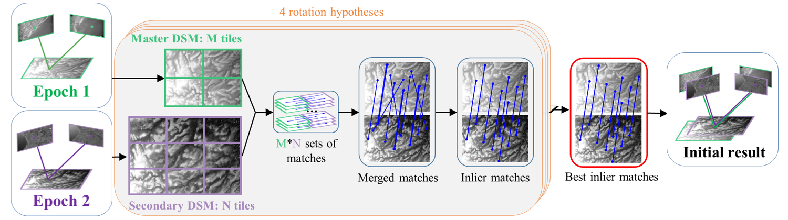
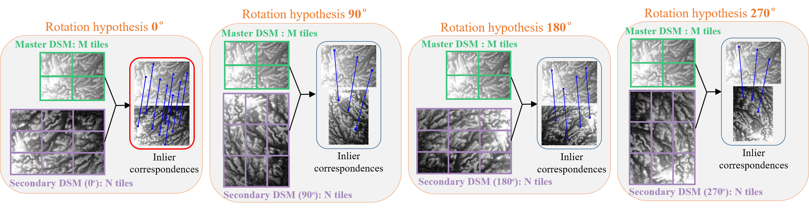
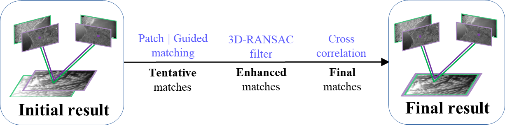
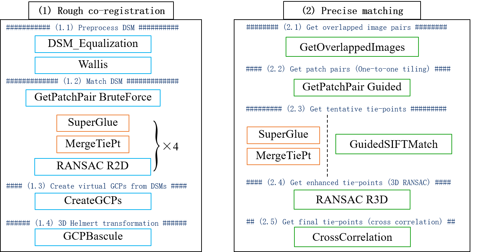

# *Historical pipeline* - tie-points extraction in diachronic images

The algorithm uses a python implementation of the [SuperGlue](https://github.com/magicleap/SuperGluePretrainedNetwork) ([Full paper](https://arxiv.org/abs/1911.11763)) sparse point detector and matcher (see the license below). 

For more details about our algorithm, please refer to:
* L. Zhang, E. Rupnik, M. Pierrot-Deseilligny, [Feature matching for multi-epoch historical aerial images](https://www.sciencedirect.com/science/article/pii/S0924271621002707), ISPRS journal of photogrammetry and remote sensing, 182 (2021), pp. 176-189 ([PDF](https://arxiv.org/abs/2112.04255))
* Tutorials: [Github](https://github.com/micmacIGN/Documentation/tree/master/Tutorials/MicMacTiePHistoP); [Google Colab](https://colab.research.google.com/drive/14okQ8bBhEZmy6EGRIQvazTqrN39oc_K5)
* [Project website](https://www.umr-lastig.fr/ewelina-rupnik/historicalfeatures.html)
* [Youtube videos](https://www.youtube.com/channel/UCg7_VpmlZImh8bCDBrdXgAw)
* [Slides](https://drive.google.com/uc?id=16sJZiY3sTZSRZKBzpy2IHVloCLj6pEwP)
* [Blog](https://rfpt-sfpt.github.io/blog/feature%20matching/historical%20images/multi-epoch/pose%20estimation/self-calibration/2021/11/17/Lulin-ZHANG-LaSTIG.html)

Our workflow is illustrated as follows:

<p align="center">   </p>
<p align="center"> (a) Full workflow </p>

<p align="center">   </p>
<p align="center"> (b) Workflow of rough co-registration </p>

<p align="center">   </p>
<p align="center"> (c) Details of 4 rotation hypotheses </p>

<p align="center">   </p>
<p align="center"> (d) Workflow of precise matching </p>

## Set-up 

1. Create virtualenv, clone SuperGluePretrainedNetwork and install depedencies (```PYTHON_PATH``` is the path to ```bin/python```):

    ```bash ./install.sh PYTHON_PATH```

Virtualenv files are stored in python_env/. To remove the environement, delete the directory `python_env`.

The SuperGluePretrainedNetwork is necessary for (1) rough co-registration and (2) precise matching using the ```Feature=SuperGlue``` option. If you can't/don't want to install SuperGluePretrainedNetwork, you can still perform precise matching by setting ```Feature=SIFT```. Note that in this case your datasets must be roughly co-registered.

## Contents

The pipeline is accessible via 

```mm3d TiePHistoP -help```

The command ```TiePHistoP``` includes 2 main parts: (1) rough co-registration and (2) precise matching. It will launch the whole pipeline by automatically calling several subcommands as follows (the coloured rectangles represent the subcommands). You can set the parameter "Exe=0" to print all the subcommands instead of executing it.

<center>
  
  <br> 
</center>


## License

This code uses third-party code that is not permitted for commercial use. Please refer to [SuperGlue license](https://github.com/magicleap/SuperGluePretrainedNetwork/blob/master/LICENSE) for more information.
